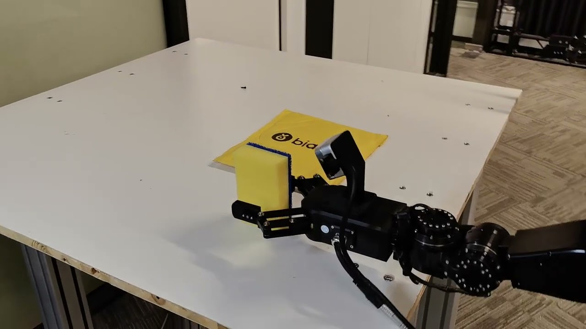

# Dora-OpenLoong

> 本项目旨在将 `Dora-rs` 生态与 `OpenLoong SDK` 进行深度融合


## 项目描述

本项目基于青龙机器人平台，构建了一个多模态（RGB-D摄像头、语音输入、视觉语言模型）的机器人系统，旨在开发智能机器人帮助物流和服务业务。系统包括：

- 感知层
  - 采用Intel RealSense D435 RGB-D 相机和微fon数字麦克风阵列捕捉图像和声音流数据。

- 处理层
  - 图像分割、语音识别和视觉语言处理。我们使用 `SAM2`、`Distil-Whisper-Large`和 `QwenVL-3`模型分别完成了对图像分割、语音识别和决策任务的实现。

- 控制层
  - 利用状态机机制管理机器人的动作和状态，根据环境的情况和语音命令决定机器人采取何种动作。

- 输出层
  - 执行器控制部分通过双臂机械手实现系统对环境的操作，通过 `rerun` 显示当前机器人的状态及执行流程的实时图形界面。

## 如何开发

#### Notice

1. 需要安装 `rust` 环境 (在 `rust-toolchain.toml` 中进行描述)
2. 推荐使用 `uv` 工具来管理 `python` 项目及包管理，详情见 [astral-uv](https://docs.astral.sh/uv/)
3. 需要安装 `dora-cli` 工具，详情见 [dora-ai](https://dora-rs.ai/?current-os=pip)（推荐使用 2 中的 `uv` 进行安装）
4. 需要安装 `sdk/openloong_sim_sdk_release` 项目所需的所有依赖
5. 首次运行需要从 `Hugging Face` 中缓存 `Whisper` 语音模型至本地，从 `Model Space` 中缓存 `Qwen3-VL` 模型至本地，需要较长的初始化时间，并且需要确保特殊网络环境访问 [Hugging Face](https://huggingface.co/)
6. 为确保运行成功率，也可提前缓存模型至本地，并配置节点 `dora-distil-whisper` 和 `dora-qwen2-5-vl` 中的环境变量 `DEFAULT_PATH` 为模型本地路径

```shell
git clone https://github.com/XiaoPengYouCode/dora-openloong
cd dora-openloong
dora build example/loong/pick-place.yml
dora run example/loong/pick-place.yml
```

## 项目运行演示

[](https://www.youtube.com/watch?v=_5tFXJQIzi4)
